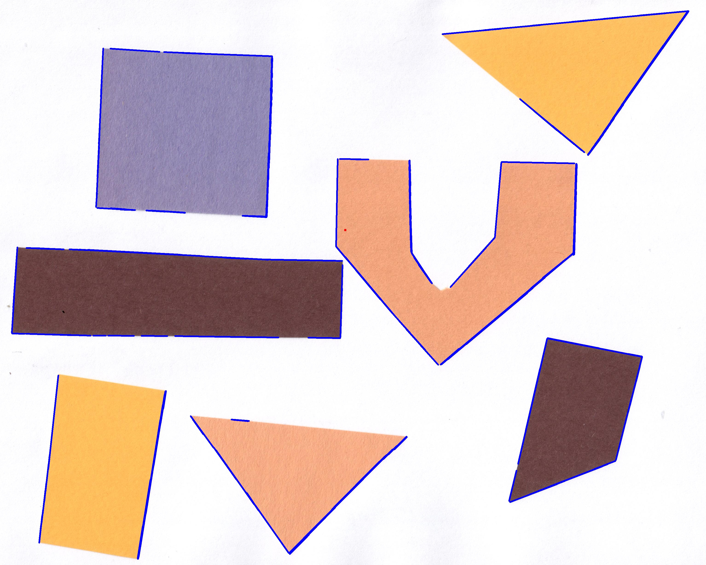

# closest-edge-from-point
Code for finding distance between a point and its closest edge.

## Steps

1. Read image and convert into greyscale
2. Perform edge detection on the greyscale image. OpenCV canny edge detector used here. Perform erosion and dilation to fill up gaps.
3. Perform line detection using Hough Transform.
4. Find min distance of the given point from all lines and select the min distance line.

## Usage
1. pip install -r requirements.txt
2. Run complete jupyter notebook
3. To generate result images run ```python3 closest_edge.py```

## Original Image


## Edges Detected


## Image with lines marked


## Final image with point marked (in RED) and closest edge marked (in BLUE).

